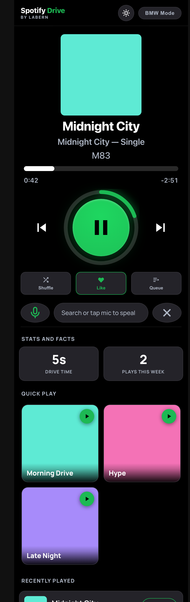
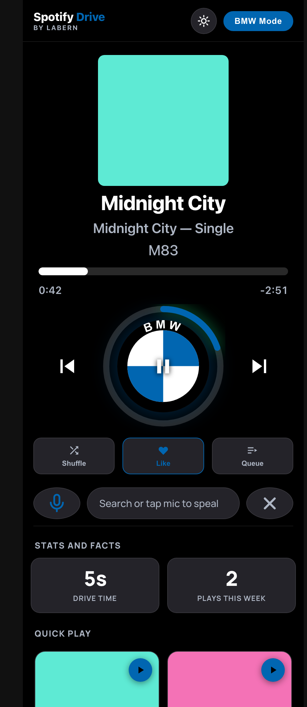
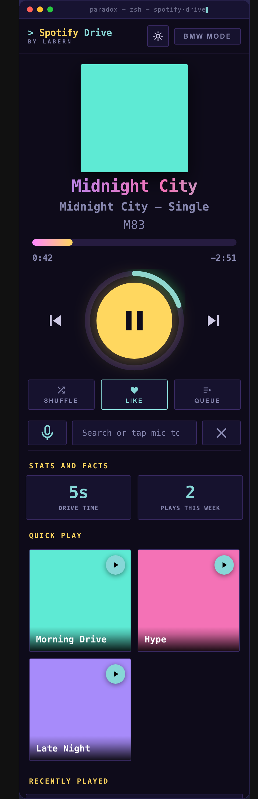

# Spotify Drive 🐿️

A **Spotify remote built for driving** — huge buttons, glanceable, and everything
on one screen so you never have to look away from the road for long. It controls
your *active* Spotify device (phone, CarPlay, speaker) through the Spotify Web API.

**Live:** https://labern.github.io/Clean/SpotifyDrive/index.html

<p align="center">
  
</p>

> Screenshots use the built-in **demo mode** (sample data, no login) — the solid
> colour squares are placeholder album art.

---

## Why

In-car Spotify is fiddly and dangerous: small targets, screen-switching, and voice
control that misfires. Spotify Drive is the opposite — **size and tap-safety first**:

- The play/pause button is the hero (~190px) with a progress ring around it.
- Search results render **inline** under the controls — no full-screen switches.
- Picking a song snaps the big player back automatically.
- Errors never fail silently: you get a toast + a full-width **Back** button.

## Features

- **Now playing** — big wrapping title, album, artist, chunky progress bar with
  elapsed / remaining time, and a play gauge with a progress ring.
- **Transport** — oversized play/pause, previous, next, shuffle, like.
- **Search** — inline as-you-type, with **one-tap voice dictation** (tap the mic,
  speak; re-tap wipes a wrong result and re-listens; filler words like “play…”
  are stripped).
- **Swipe a song** — swipe **left to play**, **right to queue**, with feedback.
- **Scrub** — touch the progress bar and it grows thick to drag-seek.
- **Stats and Facts dashboard** — live **drive time**, **plays this week** for the
  current track (from a local play-log), plus **Quick Play** tiles (one tap plays
  a whole playlist), recently played, and your playlists.
- **In-app everything** — album, artist, playlist and queue views render inline;
  you never get bounced to the Spotify app.
- **Queue** — add to queue with optimistic feedback, see what’s up next, **clear
  the queue**, and the last queued track flows into its own album instead of stopping.
- **BMW Mode** — one toggle re-themes the whole app to BMW blue/white/black and
  rebuilds the play button as the BMW roundel.
- **Light / Dark** — icon-only toggle that composes with BMW Mode.

<p align="center">
  
  &nbsp;
  
</p>

<p align="center"><em>Left: BMW Mode. Right: <strong>PARADOX edition</strong> — the whole app reskinned as a terminal (★★★★★ × PARADOX style), on the <code>paradox-edition</code> branch.</em></p>

## How it works

- **One self-contained file** — `variants/pure/index.html` is the whole app
  (inline `<style>` and `<script>`). No build step, no dependencies, no backend.
- **Spotify Web API** with **PKCE OAuth** (the verifier lives in `localStorage`,
  not `sessionStorage`, so an installed iOS PWA survives the redirect).
- **Themeable from one place** — every accent is a CSS custom property; BMW Mode
  is literally one rule overriding `--green`, and the light theme overrides a few
  surface tokens. They compose.
- **Demo mode** — auto-on for `localhost` / LAN / a `?demo=1` query (never on the
  live host) so the UI can be tried without a Spotify login.

## Honest limitations (Spotify API)

- **`limit` must be ≤ 10** for this app’s account, or the API returns
  `400 invalid limit`. Every call is capped at 10 (enforced by a test).
- **No remove-from-queue** endpoint exists — you can add to the queue and read it,
  but not delete a single item. “Clear queue” works by re-issuing the current
  context (the only mechanism Spotify allows).
- **Web Speech dictation** works in a Safari tab but is unreliable in an installed
  iOS PWA, so the mic falls back to the keyboard dictation there.

## Tests

A zero-dependency Node harness runs the app’s real inline `<script>` inside a
mocked DOM + Spotify API — no browser, no account, no deploy:

```bash
node SpotifyDrive/tests/run.mjs            # the live "pure" variant (220 tests)
node SpotifyDrive/tests/run.mjs SpotifyDrive/variants/neo/index.html
```

It covers playback, search, the inline views, the queue (add / retry / clear /
the no-duplicate re-tap), swipe + scrub wiring, theming, scopes, and more.

## Setup (to run your own)

1. Create a free app at the [Spotify Developer Dashboard](https://developer.spotify.com/dashboard).
2. Set `CLIENT_ID` near the top of `variants/pure/index.html`.
3. Register the redirect URI it uses (the page’s own URL).
4. Open it over HTTPS (GitHub Pages works) — Premium is required for playback control.

## Layout

```
SpotifyDrive/
├── variants/pure/index.html   # THE app (live)
├── tests/run.mjs              # zero-dep test harness
├── docs/                      # roadmap, notes, known issues, screenshots
└── README.md
```

Alternate looks live on their own branches — same layout and logic, demo-mode previews:

- **PARADOX edition** (`paradox-edition`) — the app rendered as a *terminal*: monospace,
  xterm-256 palette, window chrome + traffic lights + blinking cursor on an animated
  purple gradient. → [preview](https://labern.github.io/Clean/SpotifyDrive/paradox/index.html)
- **Neo** (`ui-experiment`) — Space Grotesk + Inter, squircle buttons.
  → [preview](https://labern.github.io/Clean/SpotifyDrive/neo/index.html)

---

Made by Labern 🐿️
